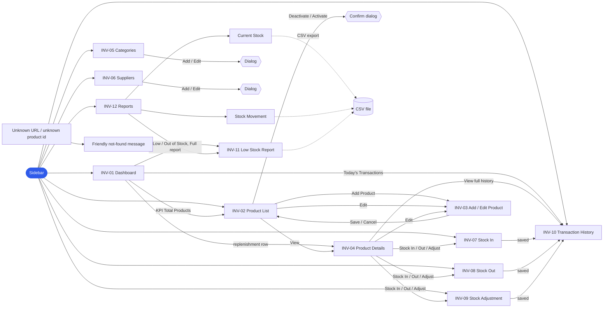

# 2. Screen Navigation Flow

Rendered image: [navigation-flow.png](navigation-flow.png)

```mermaid
flowchart LR
  SB([Sidebar]):::nav --> DASH[INV-01 Dashboard]
  SB --> PL[INV-02 Product List]
  SB --> CAT[INV-05 Categories]
  SB --> SUP[INV-06 Suppliers]
  SB --> SI[INV-07 Stock In]
  SB --> SO[INV-08 Stock Out]
  SB --> SA[INV-09 Stock Adjustment]
  SB --> TH[INV-10 Transaction History]
  SB --> REP[INV-12 Reports]

  DASH -- KPI Total Products --> PL
  DASH -- Low / Out of Stock, Full report --> LSR[INV-11 Low Stock Report]
  DASH -- Today's Transactions --> TH
  DASH -- replenishment row --> PD

  PL -- Add Product --> PF[INV-03 Add / Edit Product]
  PL -- View --> PD[INV-04 Product Details]
  PL -- Edit --> PF
  PL -- Deactivate / Activate --> CONF{{Confirm dialog}}
  PD -- Edit --> PF
  PD -- Stock In / Out / Adjust --> SI
  PD -- Stock In / Out / Adjust --> SO
  PD -- Stock In / Out / Adjust --> SA
  PD -- View full history --> TH
  PF -- Save / Cancel --> PL

  CAT -- Add / Edit --> CATD{{Dialog}}
  SUP -- Add / Edit --> SUPD{{Dialog}}

  SI -- saved --> TH
  SO -- saved --> TH
  SA -- saved --> TH

  REP --> CS[Current Stock]
  REP --> MV[Stock Movement]
  REP --> LSR
  CS -. CSV export .-> CSV[(CSV file)]
  MV -.-> CSV
  LSR -.-> CSV

  ANY[Unknown URL / unknown product id] --> NF[Friendly not-found message]

  classDef nav fill:#2f5bea,color:#fff,stroke:#2f5bea;
```
